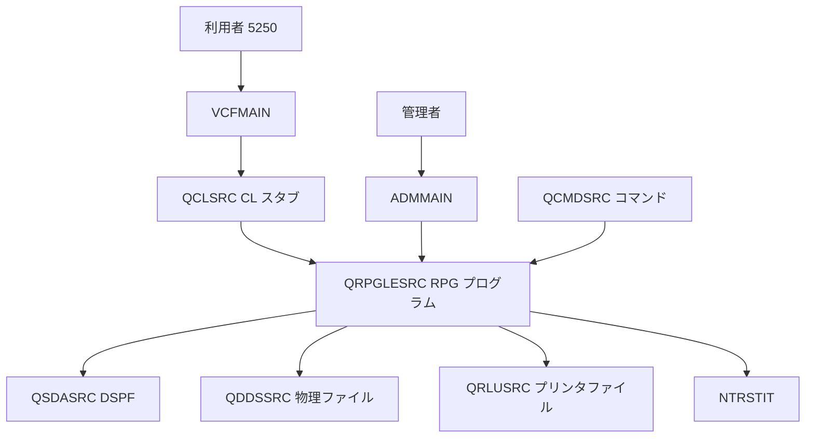
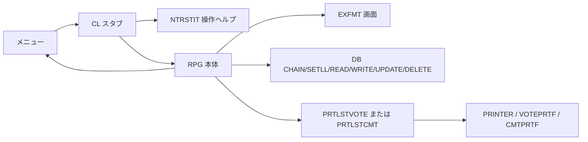
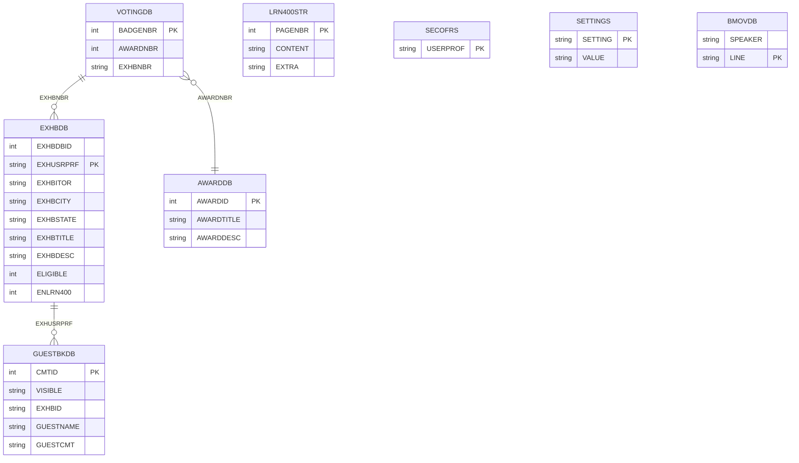

# VCF/400 RPG アプリケーション仕様書

## 1. 目的と対象範囲

本書は、IBM i 上の VCF/400 アプリケーションを Java へ移行するフェーズ1の確定仕様である。解析メモ `/home/ubuntu/vcf400-analysis.md` を正とし、RPG、DDS、CL、メニュー、コマンド、プリンタ定義を照合した。画面上の英語メッセージ、定数名、プログラム名、ファイル名は原文を維持する。

Java 側は Java 17、Maven、Spring Boot 3.3.x、Spring Web、Spring Data JPA、Thymeleaf、Validation、H2（インメモリ）を予定する。RPG のプログラム単位をサービスクラス、サブルーチンを対応するメソッドとして設計し、業務結果はメッセージを含む Result オブジェクトで返す。

## 2. 全体アーキテクチャ

### 2.1 IBM i ライブラリ構成

| ライブラリ | 役割 |
|---|---|
| `QRPGLESRC` | 投票、ゲストブック、LEARN/400、管理、集計、印刷呼出しの RPGLE ソース |
| `QDDSSRC` | 8個の物理ファイル（`.pf`）による DB 定義 |
| `QSDASRC` | 5250 ワークステーション画面（`.dspf`）のレコードフォーマット、項目、ファンクションキー |
| `QCLSRC` | 現在ユーザを取得し、本体 RPG を呼ぶ CL スタブ。`LRN400STUB` は DB オーバーライドも行う |
| `QMNUSRC` | `VCFMAIN`、`MAIN`、`ADMMAIN` のメニュー DDS とメニューコマンド |
| `QCMDSRC` | 管理・集計機能を起動するカスタムコマンド |
| `QRLUSRC` | 投票・コメントのレシートとテスト印刷用のプリンタ DDS |

### 2.2 コンポーネント図

### 2.3 呼出し関係図

`VCFMAIN` の 11/12/13 はそれぞれ `VOTESTUB`/`ADDGBSTUB`/`READGBSTUB` を経由する。`LRN400STUB` は `OVRDBF FILE(LRN400STR) TOFILE(VCF/&PROFILE)` 後に `LRN400` を呼ぶ。`VCFSTUB` は `EXHBMENU` を呼ぶ。各本体は `EXFMT` 後、または終了条件成立時に `*INLR=*ON` と `RETURN` で終了する。

## 3. DB モデル一覧

全物理ファイルは DDS の `UNIQUE` 指定を持つ。`EXHBDBID` は RPG のどのプログラムも設定せず、常に `0` となる。

| ファイル/レコード | フィールド名 | 型 | 桁 | キー |
|---|---|---|---:|---|
| `VOTINGDB/VOTINGREC` | `BADGENBR` | 4B0 | 4 | K |
|  | `AWARDNBR` | 3B0 | 3 |  |
|  | `EXHBNBR` | 9A | 9 |  |
| `AWARDDB/AWARDRCD` | `AWARDID` | 3B0 | 3 | K |
|  | `AWARDTITLE` | 100A | 100 |  |
|  | `AWARDDESC` | 1000A | 1000 |  |
| `EXHBDB/EXHBREC` | `EXHBDBID` | 3B0 | 3 |  |
|  | `EXHUSRPRF` | 9A | 9 | K |
|  | `EXHBITOR` | 20A | 20 |  |
|  | `EXHBCITY` | 20A | 20 |  |
|  | `EXHBSTATE` | 2A | 2 |  |
|  | `EXHBTITLE` | 50A | 50 |  |
|  | `EXHBDESC` | 1000A | 1000 |  |
|  | `ELIGIBLE` | 1B0 | 1 |  |
|  | `ENLRN400` | 1B0 | 1 |  |
| `GUESTBKDB/GUESTBKRCD` | `CMTID` | 4B0 | 4 | K |
|  | `VISIBLE` | 1A | 1 |  |
|  | `EXHBID` | 9A | 9 |  |
|  | `GUESTNAME` | 20A | 20 |  |
|  | `GUESTCMT` | 200A | 200 |  |
| `LRN400STR/LRN400RCD` | `PAGENBR` | 4B0 | 4 | K |
|  | `CONTENT` | 1500A | 1500 |  |
|  | `EXTRA` | 9A | 9 |  |
| `SECOFRS/USRPROFR` | `USERPROF` | 9A | 9 | K |
| `SETTINGS/SETTINGSR` | `SETTING` | 9A | 9 | K |
|  | `VALUE` | 9A | 9 |  |
| `BMOVDB/BMOVREC` | `SPEAKER` | 9A | 9 |  |
|  | `LINE` | 50A | 50 | K |

## 4. プログラム一覧

| 名前 | 役割 | 参照ファイル | 画面 | 仕様書 |
|---|---|---|---|---|
| `ADDVOTE` | 投票受付 | VOTINGDB, EXHBDB, AWARDDB, SETTINGS | VOTESCR | [ADDVOTE](programs/ADDVOTE.md) |
| `ADDGBCMT` | ゲストブック投稿 | GUESTBKDB, EXHBDB | GUESTBKSCR | [ADDGBCMT](programs/ADDGBCMT.md) |
| `READGBCMT` | コメント閲覧 | GUESTBKDB, EXHBDB | GUESTBKSCR | [READGBCMT](programs/READGBCMT.md) |
| `LRN400` | LEARN/400 閲覧 | LRN400STR | LRN400SCR | [LRN400](programs/LRN400.md) |
| `LRN400AUT` | LEARN/400 自動閲覧 | LRN400STR | LRNAUTO | [LRN400AUT](programs/LRN400AUT.md) |
| `ADMLRN400` | LEARN/400 編集 | LRN400STR, SECOFRS | LRN400SCR | [ADMLRN400](programs/ADMLRN400.md) |
| `EXHBMENU` | 出展者メニュー | EXHBDB, SETTINGS | EXHBMENUSC | [EXHBMENU](programs/EXHBMENU.md) |
| `ADMVOTERPT` | 投票集計 | VOTINGDB, EXHBDB, SECOFRS | ADMVOTERES | [ADMVOTERPT](programs/ADMVOTERPT.md) |
| `ADMCRTEXHB` | 出展登録・編集・削除 | EXHBDB, SECOFRS | EXHBMENUSC | [ADMCRTEXHB](programs/ADMCRTEXHB.md) |
| `ADMHIDECMT` | コメント公開状態変更 | GUESTBKDB, SECOFRS | GUESTBKSCR | [ADMHIDECMT](programs/ADMHIDECMT.md) |
| `ADMADDSOFR` | 管理者追加 | SECOFRS | ADMSCR | [ADMADDSOFR](programs/ADMADDSOFR.md) |
| `ADMSETTING` | 設定変更 | SETTINGS | SETUPSCR | [ADMSETTING](programs/ADMSETTING.md) |
| `BEEMOVIE` | 映画台詞一覧 | BMOVDB | BMOVSCR | [BEEMOVIE](programs/BEEMOVIE.md) |
| `CREDITS` | クレジット表示 | なし | CREDITSSCR | [CREDITS](programs/CREDITS.md) |
| `NTRSTIT` | 操作ヘルプ表示 | なし | INTERSCR | [NTRSTIT](programs/NTRSTIT.md) |
| `PARAMETER` | パラメータ表示テスト | なし | TESTSUITE | [PARAMETER](programs/PARAMETER.md) |
| `PRTLSTVOTE` | 最新投票のレシート印刷 | VOTINGDB, VOTEPRTF | なし | [PRTLSTVOTE](programs/PRTLSTVOTE.md) |
| `OLDADDVOTE` | 旧版投票（非移行） | VOTINGDB, EXHBDB, AWARDDB | VOTESCR | [OLDADDVOTE](programs/OLDADDVOTE.md) |

`PRTLSTCMT` と `PRINTER` は [PRTLSTVOTE](programs/PRTLSTVOTE.md) 内で扱う。`ADMOFRLIST` は [ADMADDSOFR](programs/ADMADDSOFR.md) 内で扱う。`OLDVOTE` は [OLDADDVOTE](programs/OLDADDVOTE.md) 内で扱う。

## 5. 共通事項

1. 起動パラメータ `LAUNCH` は CL スタブが `RTVJOBA CURUSER` で取得した現在ユーザプロファイルであり、通常は出展者 ID として扱う。
2. `MM2024` はハードコードされた特権プロファイルであり、`ADDVOTE`/`ADDGBCMT` の対象 ID 自由入力と `READGBCMT` の全コメント閲覧を許可する。
3. `SECOFRS` を用いる `CHKOFRS`/`CHKUSRPRF` は全プログラムで空の TODO サブルーチンである。Java では認可を実装する予定だが、RPG の現状では未実装である。
4. 指標は `*IN12=F12 Cancel`、`*IN05=F5 Submit`、`*IN03=F3 Exit`、`*IN08=F8 Back`、`*IN10=F10 Save`。`*IN40`〜`*IN43` はエラー項目強調、`*IN70` は入力保護という前提である。
5. `ERRLINE` は複数の検証失敗時に最後に設定したエラーで上書きされる。
6. `CL` スタブは必要な場合に `NTRSTIT` を先に表示する。`LRN400STUB` の `OVRDBF` は Java では `LRN400STR` の `owner` 列で再現する前提である。
7. 印刷は Java の `PrintSpoolService` によりログとメモリ上の印刷スプールで再現する前提である。

## 6. 前提・既知の問題一覧

| ID | 前提・問題 | RPG の挙動 | Java での扱い（予定） |
|---|---|---|---|
| A-01 | 出展者別 LEARN/400 | `OVRDBF` で別物理ファイルを割り当てる | `owner` 列でスコープする |
| A-02 | `SETLL+READ` の不完全一致 | 次レコードを読み得る | 完全一致検索にする |
| A-03 | `ADDVOTE` のエラー再表示 | `ERRLINE` 設定後、再入力なしで終了する場合がある | エラーを返し再入力可能にする |
| A-04 | `READGBCMT` の結果再表示 | `READDB` 後の `EXFMT` がなく結果が次回呼出し依存 | 即時に結果を返す |
| A-05 | `EXHBMENU` パスワード | `SETLL *START` 後の先頭 `ALWVOTE` 値を使う | `PASSWORD` 設定値を使う |
| A-06 | 賞 ID 表記 | `VOTESCR` は 001=Best in Show、002=Ed Fair。`ADMVOTERPT` のコメントは逆 | `AWARDDB` シードは画面表記に合わせ、集計表示はタイトル参照 |
| A-07 | `EXHBDBID` | コピー処理がコメントアウトされ常に 0 | Java でも仕様上 0。ただし将来の採番を検討 |
| A-08 | `ADDGBCMT` の出展者確認 | `ERREXIST` は定義のみで、出展者存在チェックを実行しない | フェーズ2で仕様判断。フェーズ1は現状を記録 |
| A-09 | 管理者認可 | `SECOFRS` チェックは未実装 | Java で認可を追加予定 |
| A-10 | 旧版 | `OLDADDVOTE`/`OLDVOTE` は旧実装 | 移行対象外 |
