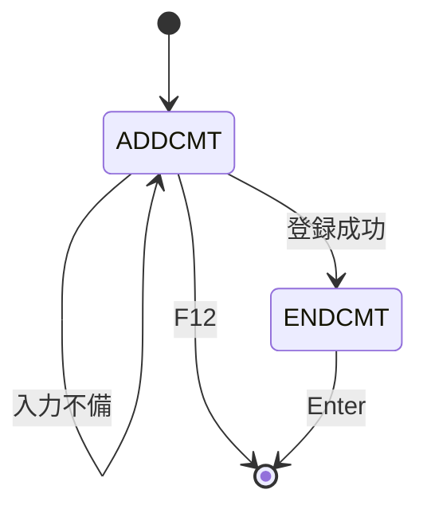
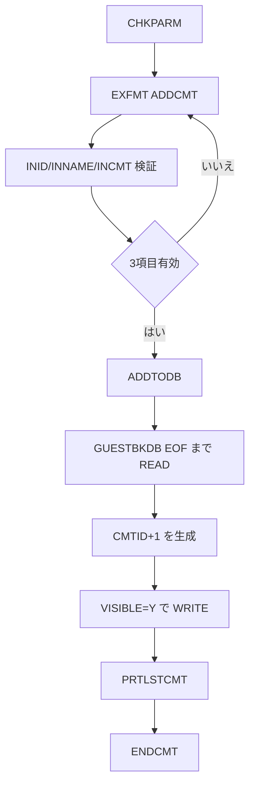

# ADDGBCMT

## 1.機能概要

出展者のゲストブックへ訪問者の名前とコメントを登録する。`LAUNCH='MM2024'` の場合は展示 ID を入力でき、それ以外は `LAUNCH` に固定する。

## 2.入出力

### *ENTRY PLIST の PARM

| 順序 | 名前 | 型/桁 | 説明 |
|---:|---|---|---|
| 1 | `LAUNCH` | 文字 20A | CL から渡す現在ユーザプロファイル |

### 画面入力・出力

| 項目名 | 型 | 桁 | 画面フォーマット | 説明 |
|---|---|---:|---|---|
| `INID` | 文字 | 9A | `ADDCMT` | Exhibit ID |
| `INNAME` | 文字 | 16A | `ADDCMT` | 投稿者名（DB は 20A） |
| `INCMT` | 文字 | 200A | `ADDCMT` | コメント |
| `ERRLINE` | 文字 | 21A | `ADDCMT` | エラー |
| — | 固定文言 | — | `ENDCMT` | `Press ENTER to exit.` 等 |

## 3.画面遷移

## 4.業務フロー

## 5.サブルーチン一覧

| BEGSR 名 | 役割 |
|---|---|
| `ADDTODB` | 最大コメント ID を読み、コメントを書き込み印刷する |
| `CHKPARM` | `LAUNCH` による展示 ID 固定/自由入力制御 |
| `ENDADDGB` | LR をオンにして終了 |

## 6.業務ルール・バリデーション

1. **BR-ADDGBCMT-01**: `INID` 空は `Must enter Exhibit ID`、`*IN40`。
2. **BR-ADDGBCMT-02**: `INNAME` 空は `Must enter your name`、`*IN41`。
3. **BR-ADDGBCMT-03**: `INCMT` 空は `Must enter a comment`、`*IN42`。
4. **BR-ADDGBCMT-04**: `CMTID` は EOF まで読んだ最後の ID に 1 を加える。空ファイルは 1 とする。
5. **BR-ADDGBCMT-05**: 新規コメントの `VISIBLE='Y'`。

`ERREXIST='Exhibit not found'` は RPG で定義のみ未使用であり、出展者存在チェックは行わない。RPG の挙動: `GUESTNAME` は DB 20A に対し画面入力は 16A。Java での扱い（予定）: 原文の DB 桁を保持し、入力上限は画面仕様に合わせる。採番の同時実行制御は前提としてフェーズ2で実装方式を決定する。

## 7.DBアクセス

| ファイル | 操作 | キー |
|---|---|---|
| `GUESTBKDB` | `READ`（EOF まで） | キー順 |
| `GUESTBKDB` | `WRITE` | `CMTID` |
| `EXHBDB` | 参照ファイル定義のみ | 実アクセスなし |

## 8.エラー処理・メッセージ一覧

| CONST 名 | 文言 | 使用有無 |
|---|---|---|
| `SUCCESS` | `Thanks for commenting` | 定義のみ |
| `VISYES` | `Y` | 使用 |
| `ERREXID` | `Must enter Exhibit ID` | 使用 |
| `ERRNOCMT` | `Must enter a comment` | 使用 |
| `ERREXIST` | `Exhibit not found` | 未使用 |
| `ERRNONAME` | `Must enter your name    ` | 使用 |

## 9.前提(assumption)と RPG の既知の問題点

- 前提: `MM2024` は展示 ID を自由入力できる特権プロファイルである。
- RPG の挙動: 投稿後は `PRTLSTCMT` が DB 最終レコードを印刷する。
- RPG の挙動: 出展者が存在しない ID も登録できる。Java での扱い（予定）: フェーズ1では現状を仕様化し、必須化は別途判断する。
