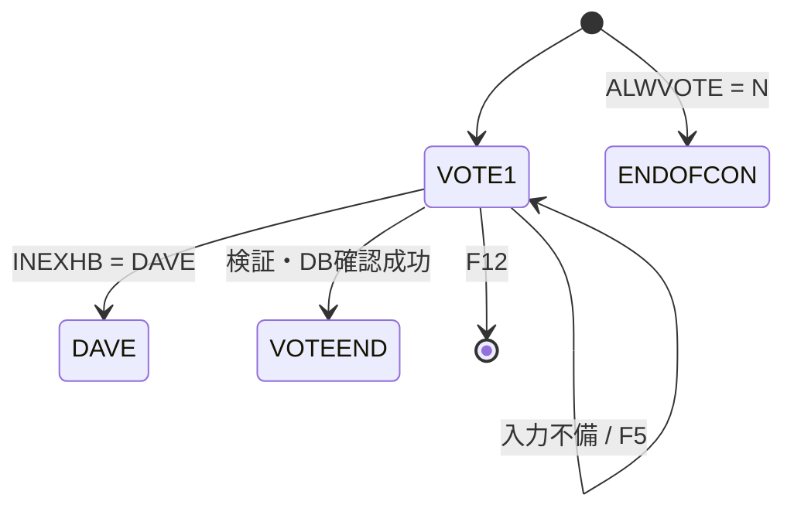
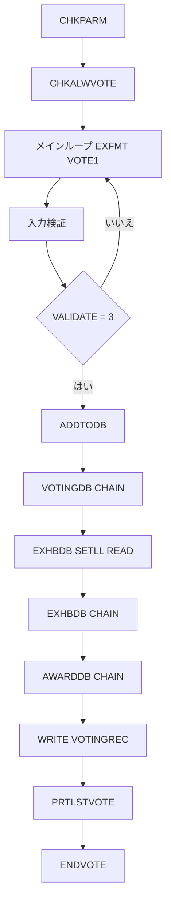

# ADDVOTE

## 1.機能概要

`LAUNCH` で渡された出展者 ID に対する投票を受け付ける。`MM2024` の場合は `INEXHB` を自由入力、それ以外は `LAUNCH` を固定表示する。投票可否、1バッジ1票、出展適格性、賞の存在を確認し、成功時に `PRTLSTVOTE` を呼ぶ。

## 2.入出力

### *ENTRY PLIST の PARM

| 順序 | 名前 | 型/桁 | 説明 |
|---:|---|---|---|
| 1 | `LAUNCH` | 文字 9A | CL が取得した現在ユーザプロファイル（出展者 ID） |

### 画面入力・出力

| 項目名 | 型 | 桁 | 画面フォーマット | 説明 |
|---|---|---:|---|---|
| `INPUTBADGE` | 10進数 | 4D0 | `VOTE1` 入力 | SFGE Badge Number |
| `INEXHB` | 文字 | 9A | `VOTE1` 入出力 | Exhibit ID。通常は保護 |
| `INPUTAWARD` | 10進数 | 3D0 | `VOTE1` 入力 | Award ID |
| `ERRLINE` | 文字 | 45A | `VOTE1` 出力 | 検証エラー |
| — | 固定文言 | — | `VOTEEND` | 投票完了 |
| — | 固定文言 | — | `DAVE` | `DAVE` 入力時の画面 |
| — | 固定文言 | — | `NOVOTEALWD`/`ENDOFCON` | 不適格/投票期間終了 |

## 3.画面遷移

## 4.業務フロー

## 5.サブルーチン一覧

| BEGSR 名 | 役割 |
|---|---|
| `ADDTODB` | 重複・適格・存在・賞を確認し投票を登録 |
| `CHKPARM` | `LAUNCH` を `USERPRF` に移し展示 ID を決定 |
| `CHKALWVOTE` | `SETTINGS` の `ALWVOTE` を読み、`N` なら `ENDOFCON` |
| `DODAVE` | `DAVE` 画面を表示 |
| `ENDVOTE` | `VOTEEND` を表示して終了 |

## 6.業務ルール・バリデーション

1. **BR-ADDVOTE-01**: `INPUTBADGE=0` の場合、`ERRLINE='Must enter badge number'`、`*IN40` を設定する。
2. **BR-ADDVOTE-02**: `INEXHB` が空の場合、`ERRLINE='Must enter Exhibit ID'`、`*IN41` を設定する。
3. **BR-ADDVOTE-03**: `INPUTAWARD=0` の場合、`ERRLINE='Must enter Award ID'`、`*IN42` を設定する。
4. **BR-ADDVOTE-04**: `SETTINGS` の `ALWVOTE` が `N` の場合、投票を受け付けず `ENDOFCON` を表示する。
5. **BR-ADDVOTE-05**: `VOTINGDB` に `BADGENBR` が存在する場合、`You have already voted.` とする（1バッジ1票）。
6. **BR-ADDVOTE-06**: `EXHBDB` の `ELIGIBLE=0` の場合、`Exhibit ineligible for award` とする。
7. **BR-ADDVOTE-07**: 展示が存在しない場合、`Exhibit does not exist` とする。
8. **BR-ADDVOTE-08**: 賞が存在しない場合、`Award does not exist.` とする。
9. **BR-ADDVOTE-09**: `INEXHB='DAVE'` の場合、DB 登録せず `DAVE` を表示する。

RPG の挙動: `SETLL+READ` により不存在 ID で別レコードの `ELIGIBLE` を評価し得る。またチェック失敗時は `ERRLINE` を設定するだけで再表示しない。Java での扱い（予定）: 主キー完全一致後に適格性を判定し、失敗は Result で返して再入力可能にする。`ERRLINE` は最後に設定したエラーが勝つ。

## 7.DBアクセス

| ファイル | 操作 | キー |
|---|---|---|
| `VOTINGDB` | `CHAIN` | `BADGENBR=INPUTBADGE` |
| `VOTINGDB` | `WRITE` | `BADGENBR, AWARDNBR, EXHBNBR` |
| `EXHBDB` | `SETLL`/`READ`、`CHAIN` | `EXHUSRPRF=INEXHB` |
| `AWARDDB` | `CHAIN` | `AWARDID=INPUTAWARD` |
| `SETTINGS` | `SETLL *LOVAL`/`READ` | `SETTING` 全件、`ALWVOTE` |

## 8.エラー処理・メッセージ一覧

| CONST 名 | 文言 | 使用有無 |
|---|---|---|
| `SUCCESS` | `You have voted successfully` | 定義のみ（画面では固定文言） |
| `ERRBLKBG` | `Must enter badge number` | 使用 |
| `ERRBLKEX` | `Must enter Exhibit ID` | 使用 |
| `ERRBLKAW` | `Must enter Award ID` | 使用 |
| `ERREXIST` | `You have already voted.` | 使用 |
| `ERRENTER` | `Use F5 key to submit` | 定義のみ |
| `ERRPROHB` | `Exhibit ineligible for award` | 使用 |
| `ERRNOEXB` | `Exhibit does not exist` | 使用 |
| `ERRNOAWD` | `Award does not exist.` | 使用 |
| `ERRDBG1`/`ERRDBG2` | `DBG: MM2024 parm` / `DBG: other parm` | 未使用 |

## 9.前提(assumption)と RPG の既知の問題点

- 前提: `MM2024` は `SECOFRS` の実検索ではなく特権プロファイルとして扱う。
- 前提: Java の賞シードは `VOTE1` の表記（001=`Best in Show Award`、002=`The Ed Fair Award`）に合わせる。
- RPG の挙動: 賞のコメント/集計側に 001/002 の説明逆転がある。Java での扱い（予定）: `AWARDDB` のタイトルを正とする。
- RPG の挙動: `ENDVOTE` に印刷 CALL がコメントアウトされている。Java での扱い（予定）: 成功時に `PrintSpoolService` を呼ぶ。
- RPG の挙動: `DODAVE` は `DAVE` 画面を `EXFMT` した後に `*INLR=*ON` と `RETURN` を実行するため、DB 登録には到達せずプログラムを終了する。Java でも登録せず終了する。
