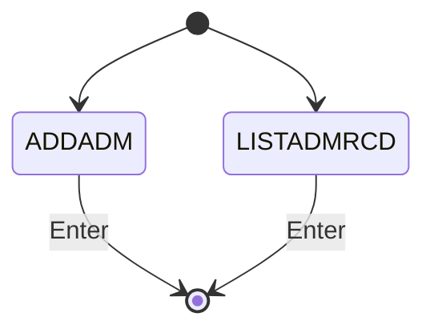
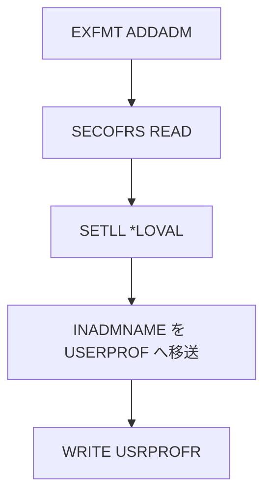

# ADMADDSOFR

## 1.機能概要

管理者プロファイルを `SECOFRS` に追加する。`ADMOFRLIST` は名称上は一覧だが、実装は同じ追加処理である。

## 2.入出力

### *ENTRY PLIST の PARM

入口パラメータは定義されていない。

### 画面入力・出力

| 項目名 | 型 | 桁 | 画面フォーマット | 説明 |
|---|---|---:|---|---|
| `INADMNAME` | 文字 | 9A | `ADDADM` | 追加する USRPRF |
| — | 固定文言 | — | `LISTADMRCD` | 一覧未実装プレースホルダ |

## 3.画面遷移

## 4.業務フロー

## 5.サブルーチン一覧

BEGSR はない。`ADMOFRLIST` も同じ直線的な処理である。

## 6.業務ルール・バリデーション

1. **BR-ADMADDSOFR-01**: Enter 後、`INADMNAME` を `SECOFRS.USERPROF` として登録する。
2. **BR-ADMADDSOFR-02**: `SECOFRS` の UNIQUE キー重複は登録できない。

RPG の挙動: 空入力検証や重複例外処理がない。Java での扱い（予定）: 空入力と重複を検証し、利用者向けエラーを返す。

## 7.DBアクセス

| ファイル | 操作 | キー |
|---|---|---|
| `SECOFRS` | `READ` | 全件 |
| `SECOFRS` | `SETLL *LOVAL` | 先頭 |
| `SECOFRS` | `WRITE` | `USERPROF=INADMNAME` |

## 8.エラー処理・メッセージ一覧

| CONST 名 | 文言 | 使用有無 |
|---|---|---|
| `STSOK` | `Status updated` | 定義のみ |

## 9.前提(assumption)と RPG の既知の問題点

- 前提: 管理者追加画面へ到達した時点で呼出し元を認証済みとする。
- RPG の挙動: `ADMOFRLIST` は一覧ではなく追加処理のコピー。Java での扱い（予定）: 一覧と追加を別機能として設計する。
- RPG の挙動: UNIQUE 違反は未処理例外。Java での扱い（予定）: 重複エラーメッセージを返す。
