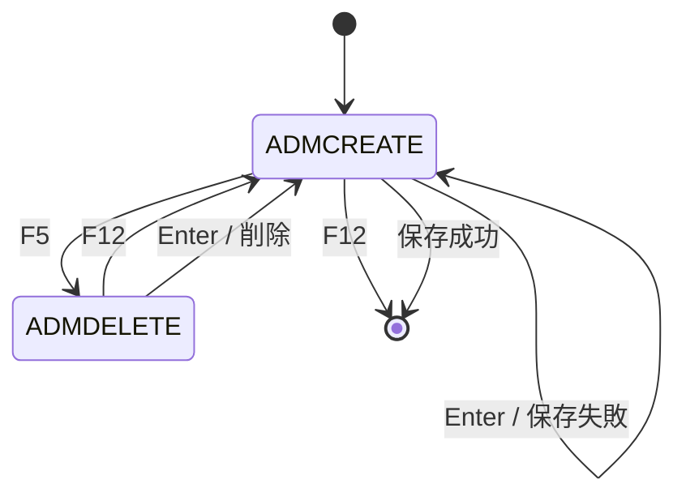
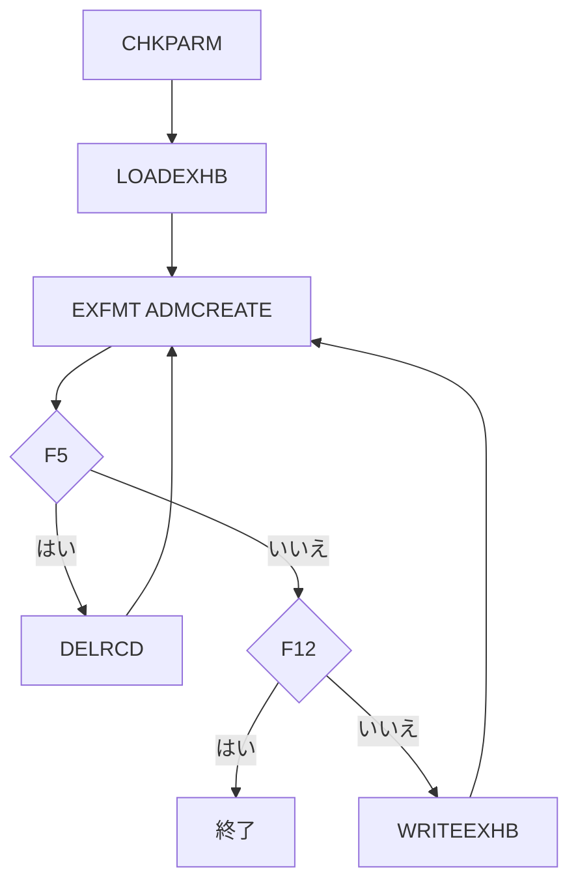

# ADMCRTEXHB

## 1.機能概要

展示の新規登録、既存編集、削除を行う管理プログラム。`EXHIBIT='NONE'` は新規、それ以外は既存検索または新規作成候補とする。

## 2.入出力

### *ENTRY PLIST の PARM

| 順序 | 名前 | 型/桁 | 説明 |
|---:|---|---|---|
| 1 | `LAUNCH` | 文字 9A | 呼出し元ユーザ |
| 2 | `EXHIBIT` | 文字 9A | 編集対象 ID、`NONE` で新規 |

### 画面入力・出力

| 項目名 | 型 | 桁 | 画面フォーマット | 説明 |
|---|---|---:|---|---|
| `INUSRPRF` | 文字 | 9A | `ADMCREATE` | 展示 ID |
| `INTITLE` | 文字 | 60A | `ADMCREATE` | タイトル（DB 50A） |
| `INNAME` | 文字 | 20A | `ADMCREATE` | 出展者名 |
| `INCITY` | 文字 | 15A | `ADMCREATE` | 市（DB 20A） |
| `INSTATE` | 文字 | 2A | `ADMCREATE` | 州 |
| `INDESC` | 文字 | 1000A | `ADMCREATE` | 説明 |
| `INELIGIBLE` | 文字 | 1A | `ADMCREATE` | 0/1 |
| `INLRN400EN` | 数値 | 1 | `ADMCREATE` | LEARN/400 0/1 |
| `ERRLINE` | 文字 | 30A | `ADMCREATE` | 状態メッセージ |
| `DLTEXHNAM` | 文字 | 9A | `ADMDELETE` | 削除対象 |

## 3.画面遷移

## 4.業務フロー

## 5.サブルーチン一覧

| BEGSR 名 | 役割 |
|---|---|
| `LOADEXHB` | 対象展示を読込み、新規/編集モードを設定 |
| `WRITEEXHB` | 入力を DB レコードへコピーして登録/更新 |
| `DELRCD` | 確認画面後に展示を削除 |
| `CHKOFRS` | 空サブルーチン |
| `CHKPARM` | `LAUNCH` と `EXHIBIT` を設定 |

## 6.業務ルール・バリデーション

1. **BR-ADMCRTEXHB-01**: `EXHIBIT='NONE'` は新規モード。
2. **BR-ADMCRTEXHB-02**: 対象が存在すれば項目を読込み編集モード、なければ `USRPRF not found, creating new`。
3. **BR-ADMCRTEXHB-03**: `INUSRPRF` 空は `USRPRF cannot be blank     `。
4. **BR-ADMCRTEXHB-04**: 新規時に同一 `INUSRPRF` が存在すれば `Error - USRPRF exists`。
5. **BR-ADMCRTEXHB-05**: 更新時は `EXHBREC` を UPDATE する。
6. **BR-ADMCRTEXHB-06**: F5 は削除確認を経て Enter で DELETE、F12 で取消。
7. **BR-ADMCRTEXHB-07**: 削除対象不存在は `Not found - not deleted`、成功は `USRPRF was deleted from DB`。

RPG の挙動: `EXHBDBID` へのコピーはコメントアウトされ常に 0。画面の `INTITLE=60A`/`INCITY=15A` は DB 桁と異なる。Java での扱い（予定）: DB 桁を正とし入力時に上限を検証する。`SECOFRS` 認可は未実装。

## 7.DBアクセス

| ファイル | 操作 | キー |
|---|---|---|
| `EXHBDB` | `CHAIN`/`READE` | `EXHUSRPRF=EDTEXHB` |
| `EXHBDB` | `SETLL`/`READ` | `EDTEXHB`（更新前） |
| `EXHBDB` | `CHAIN` | `INUSRPRF`（重複確認） |
| `EXHBDB` | `WRITE` | `EXHUSRPRF=INUSRPRF` |
| `EXHBDB` | `UPDATE` | 現在レコード |
| `EXHBDB` | `DELETE` | `INUSRPRF` |
| `SECOFRS` | 定義のみ | 認可未実装 |

## 8.エラー処理・メッセージ一覧

| CONST 名 | 文言 | 使用有無 |
|---|---|---|
| `EMPTY` | 10個の空白 | 使用 |
| `ERREXIST` | `Error - USRPRF exists` | 使用 |
| `ERRNF` | `USRPRF not found, creating new` | 使用 |
| `ERRNODEL` | `Not found - not deleted` | 使用 |
| `ERRDELOK` | `USRPRF was deleted from DB` | 使用 |
| `ERRBLANK` | `USRPRF cannot be blank     ` | 使用 |

## 9.前提(assumption)と RPG の既知の問題点

- 前提: `STREXHBEDT` の `PASSWORD` は呼出し元で認証済み情報として扱う。
- RPG の挙動: `ADMDELETE` と `ADMDELETE2` は同じ削除確認内容。Java での扱い（予定）: 1確認画面へ統合する。
- RPG の挙動: `CHKOFRS` は空。Java での扱い（予定）: `SECOFRS` による管理者認可を実装する。
