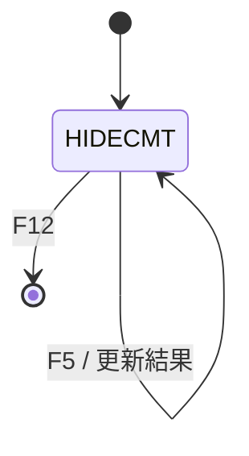
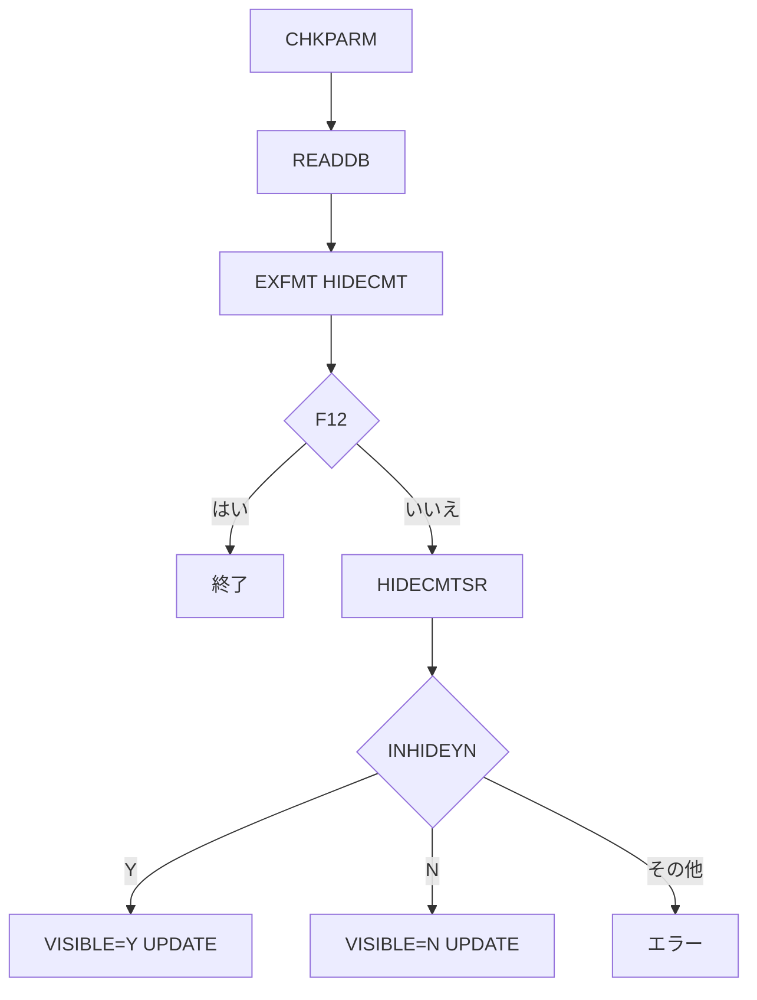

# ADMHIDECMT

## 1.機能概要

コメントの `VISIBLE` 状態を管理者が切り替える。対象コメントは `LAUNCH` で指定し、F5 で `Y`/`N` を保存する。

## 2.入出力

### *ENTRY PLIST の PARM

| 順序 | 名前 | 型/桁 | 説明 |
|---:|---|---|---|
| 1 | `LAUNCH` | 文字 20A | Comment ID（RPG 内では数値 ID へ移送） |

### 画面入力・出力

| 項目名 | 型 | 桁 | 画面フォーマット | 説明 |
|---|---|---:|---|---|
| `HIDECMTID` | 文字 | 4A | `HIDECMT` | コメント ID |
| `OUTNAME` | 文字 | 11A | `HIDECMT` | 投稿者 |
| `OUTCMT` | 文字 | 200A | `HIDECMT` | コメント |
| `CURRHIDE` | 文字 | 1A | `HIDECMT` | 現在の状態 |
| `INHIDEYN` | 文字 | 1A | `HIDECMT` | 入力 Y/N |
| `ERRLINE` | 文字 | 20A | `HIDECMT` | 結果/エラー |

## 3.画面遷移

## 4.業務フロー

## 5.サブルーチン一覧

| BEGSR 名 | 役割 |
|---|---|
| `READDB` | 対象コメントを画面へ読込む |
| `HIDECMTSR` | Y/N を状態へ反映し UPDATE |
| `CHKUSRPRF` | 空サブルーチン |
| `CHKPARM` | `LAUNCH` を ID に設定 |

## 6.業務ルール・バリデーション

1. **BR-ADMHIDECMT-01**: `INHIDEYN='Y'` は `VISIBLE='Y'` に更新する。
2. **BR-ADMHIDECMT-02**: `INHIDEYN='N'` は `VISIBLE='N'` に更新する。
3. **BR-ADMHIDECMT-03**: その他は `Must type Y or N` とし更新しない。
4. **BR-ADMHIDECMT-04**: 更新成功時は `Status updated`。

RPG の挙動: 画面ラベルは `Change Status? (Y/N)` だが入力値を直接 `VISIBLE` に設定する。`SETLL+READ` は不存在 ID の扱いを明示しない。Java での扱い（予定）: 完全一致検索とし、状態値を列挙値で検証する。

## 7.DBアクセス

| ファイル | 操作 | キー |
|---|---|---|
| `GUESTBKDB` | `SETLL`/`READ` | `CMTID=ID` |
| `GUESTBKDB` | `UPDATE` | 現在レコード |
| `SECOFRS` | 参照定義のみ | `CHKUSRPRF` 未実装 |

## 8.エラー処理・メッセージ一覧

| CONST 名 | 文言 | 使用有無 |
|---|---|---|
| `HIDEY` | `Y` | 使用 |
| `HIDEN` | `N` | 使用 |
| `ERRCMTID` | `Must enter CommentID` | 定義のみ |
| `ERRYN` | `Must type Y or N` | 使用 |
| `STSOK` | `Status updated` | 使用 |

## 9.前提(assumption)と RPG の既知の問題点

- 前提: `LAUNCH` の数値文字列変換エラーは Java で入力エラーとして扱う。
- RPG の挙動: `CHKUSRPRF` は空で、管理者認可されない。Java での扱い（予定）: `SECOFRS` 認可を追加する。
