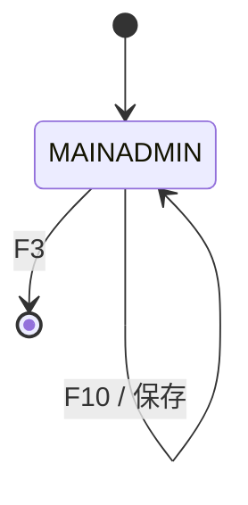
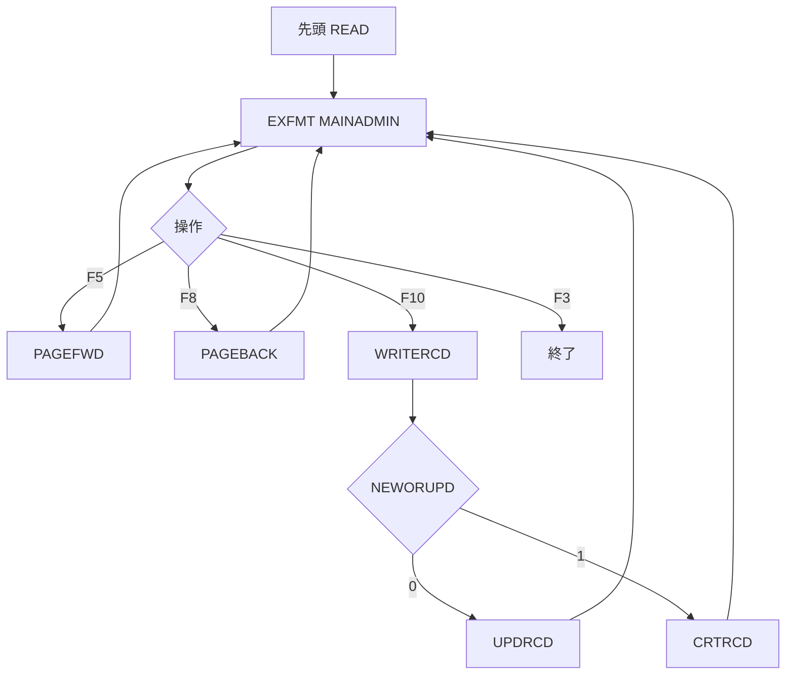

# ADMLRN400

## 1.機能概要

管理者向け LEARN/400 エディタ。ページを前後移動し、`F10 Save` で既存ページを更新または新規ページを追加する。削除機能はない。

## 2.入出力

### *ENTRY PLIST の PARM

`*ENTRY PLIST`、`LAUNCH`、`EXHIBIT` は RPG ソースでコメントアウトされている。

| 順序 | 名前 | 型/桁 | 説明 |
|---:|---|---|---|
| — | `LAUNCH`/`EXHIBIT` | 9A（コメントアウト） | 管理者・出展者スコープの候補 |

### 画面入力・出力

| 項目名 | 型 | 桁 | 画面フォーマット | 説明 |
|---|---|---:|---|---|
| `OUTPAGENBR` | 文字 | 4A | `MAINADMIN` | ページ番号 |
| `INCONTENT` | 文字 | 1500A | `MAINADMIN` | 本文 |
| `INEXTRA` | 文字 | 9A | `MAINADMIN` | 命令/追加情報 |
| `*IN60` | 指標 | — | `MAINADMIN` | 新規/既存表示属性 |
| F3/F5/F8/F10 | 指標 | — | `MAINADMIN` | 終了/前進/後退/保存 |

## 3.画面遷移

## 4.業務フロー

## 5.サブルーチン一覧

| BEGSR 名 | 役割 |
|---|---|
| `WRITERCD` | 更新/新規を振り分け |
| `UPDRCD` | 現在ページを UPDATE |
| `CRTRCD` | 現在ページ番号で WRITE |
| `PAGEFWD` | 次ページを読み、なければ新規モード |
| `PAGEBACK` | 前ページを読み既存モードに戻す |
| `CHKOFRS` | 空サブルーチン |
| `CHKPARM` | 空サブルーチン（引数定義もコメントアウト） |

## 6.業務ルール・バリデーション

1. **BR-ADMLRN400-01**: 初期レコードを編集対象として表示する。
2. **BR-ADMLRN400-02**: F5 で次ページが存在すれば既存ページを読み、なければ `NEWORUPD=1` とする。
3. **BR-ADMLRN400-03**: `NEWORUPD=0` の F10 は `UPDRCD`、`1` は `CRTRCD`。
4. **BR-ADMLRN400-04**: 新規保存後は既存ページモードに戻す。
5. **BR-ADMLRN400-05**: F8 後は `NEWORUPD=0`、`ALWFWD=1` とする。

RPG の挙動: `SETLL+READ` による対象ページ不在時の扱いは明示的エラーでない。`CHKOFRS` は空である。Java での扱い（予定）: 管理者認可を実装し、ページ不在を新規作成モードとして明示する。

## 7.DBアクセス

| ファイル | 操作 | キー |
|---|---|---|
| `LRN400STR` | `READ` | 初期先頭 |
| `LRN400STR` | `SETLL`/`READ` | `PAGENBR=CURPAGENBR` |
| `LRN400STR` | `UPDATE` | `PAGENBR=CURPAGENBR` |
| `LRN400STR` | `WRITE` | `PAGENBR=CURPAGENBR` |
| `SECOFRS` | 参照定義のみ | 認可チェック未実装 |

## 8.エラー処理・メッセージ一覧

RPG に CONST メッセージはない。`*IN60` は新規ページ表示属性を制御する。

## 9.前提(assumption)と RPG の既知の問題点

- 前提: 管理者認可は `SECOFRS` の `USERPROF` で Java 側に実装する。
- 前提: 出展者別コンテンツは `LRN400STR.owner` で分離する。
- RPG の挙動: 入口パラメータと `CHKPARM` が未実装。Java での扱い（予定）: 呼出し API の認証コンテキストで補う。
