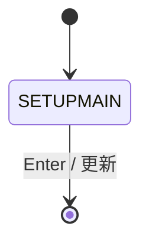
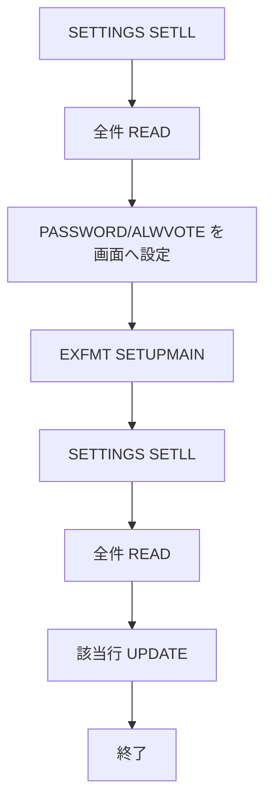

# ADMSETTING

## 1.機能概要

`SETTINGS` の `PASSWORD` と `ALWVOTE` を読み、設定画面で変更して更新する。

## 2.入出力

### *ENTRY PLIST の PARM

入口パラメータは定義されていない。

### 画面入力・出力

| 項目名 | 型 | 桁 | 画面フォーマット | 説明 |
|---|---|---:|---|---|
| `INPWD` | 文字 | 9A | `SETUPMAIN` | 管理者パスワード |
| `INALWVOTE` | 文字 | 1 | `SETUPMAIN` | 投票有効/無効 |

## 3.画面遷移

## 4.業務フロー

## 5.サブルーチン一覧

| BEGSR 名 | 役割 |
|---|---|
| `ADDTODB` | コメントアウトされた未使用処理（実際の設定更新はメイン処理） |

## 6.業務ルール・バリデーション

1. **BR-ADMSETTING-01**: `SETTING='PASSWORD'` の `VALUE` を `INPWD` に表示する。
2. **BR-ADMSETTING-02**: `SETTING='ALWVOTE'` の `VALUE` を `INALWVOTE` に表示する。
3. **BR-ADMSETTING-03**: Enter 後、両設定を対応する行へ UPDATE する。

RPG の挙動: `INALWVOTE` は画面定義上 1 桁で、説明は `1 = Voting is enabled, 0 = Voting is Disabled`。Java での扱い（予定）: `Y/N` の DB 値（解析メモのシード）と画面の 1/0 表記の変換方針をフェーズ2で確定する。

## 7.DBアクセス

| ファイル | 操作 | キー |
|---|---|---|
| `SETTINGS` | `SETLL *LOVAL`/`READ` 全件 | `SETTING` |
| `SETTINGS` | `UPDATE` | `SETTING='PASSWORD'`/`ALWVOTE` |

## 8.エラー処理・メッセージ一覧

CONST メッセージはない。画面固定文言 `Press ENTER to save your settings.` を使用する。

## 9.前提(assumption)と RPG の既知の問題点

- 前提: `ALWVOTE` は Java 内部では `Y/N` に正規化し、画面 1/0 と相互変換する。
- RPG の挙動: 存在しない設定行の作成や入力値検証はない。Java での扱い（予定）: 必須キーと許容値を検証する。
