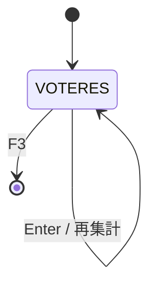
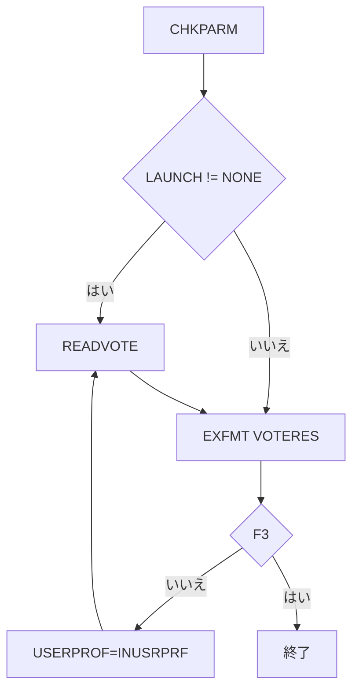

# ADMVOTERPT

## 1.機能概要

指定した出展者 ID の投票数を集計し、展示タイトル、Ed Fair、Best in Show の票数を表示する。`LAUNCH='NONE'` 以外では初回から集計する。

## 2.入出力

### *ENTRY PLIST の PARM

| 順序 | 名前 | 型/桁 | 説明 |
|---:|---|---|---|
| 1 | `LAUNCH` | 文字 9A | 初期の `USERPROF` |

### 画面入力・出力

| 項目名 | 型 | 桁 | 画面フォーマット | 説明 |
|---|---|---:|---|---|
| `INUSRPRF` | 文字 | 9A | `VOTERES` | 集計対象の出展者 |
| `OUTTITLE` | 文字 | 50A | `VOTERES` | 展示名 |
| `OUTEFA` | 文字 | 4A | `VOTERES` | Ed Fair 票数 |
| `OUTBIS` | 文字 | 4A | `VOTERES` | Best in Show 票数 |
| `OUTVOTEN` | 文字 | 4A | `VOTERES` | DB 総票数 |
| `ERRLINE` | 文字 | 40A | `VOTERES` | エラー |

## 3.画面遷移

## 4.業務フロー

## 5.サブルーチン一覧

| BEGSR 名 | 役割 |
|---|---|
| `READVOTE` | 全票を読み、総票・賞別票数・展示名を集計 |
| `CHKOFRS` | 空サブルーチン |
| `CHKPARM` | 現状空。コメントアウトされた管理者検証あり |

## 6.業務ルール・バリデーション

1. **BR-ADMVOTERPT-01**: `VOTINGDB` 全件を読み `NUMBR` を総票数とする。
2. **BR-ADMVOTERPT-02**: `EXHBNBR=USERPROF` かつ `AWARDNBR=1` を `VOTEEFA`、2 を `VOTEBIS` に加算する。
3. **BR-ADMVOTERPT-03**: `EXHBDB` に対象があれば `OUTTITLE=EXHBTITLE`、なければ `USRPRF was not found`。
4. **BR-ADMVOTERPT-04**: F3 で終了し、それ以外の入力で再集計する。

RPG の挙動: 表示ラベルは Ed Fair→Best in Show の順だが、コメント上の賞番号説明が `VOTESCR` と逆である。Java での扱い（予定）: `AWARDDB` タイトルを使い、画面ラベルとの対応を固定する。

## 7.DBアクセス

| ファイル | 操作 | キー |
|---|---|---|
| `VOTINGDB` | `SETLL *LOVAL`/`READ` 全件 | なし |
| `EXHBDB` | `CHAIN`/`READE` | `EXHUSRPRF=USERPROF` |
| `SECOFRS` | 参照定義のみ | 認可処理は空 |

## 8.エラー処理・メッセージ一覧

| CONST 名 | 文言 | 使用有無 |
|---|---|---|
| `ERRBLANK` | `USRPRF cannot be blank     ` | 未使用 |
| `ERRNOTF` | `USRPRF was not found       ` | 使用 |
| `DBGNAME` | `NL2024` | 定義のみ |

## 9.前提(assumption)と RPG の既知の問題点

- 前提: 管理画面からの呼出し時は `LAUNCH` が管理者の対象出展者 ID へ適切に変換される。
- RPG の挙動: 管理者の `SECOFRS` 検証がコメントアウトされている。Java での扱い（予定）: 認可を追加する。
