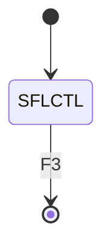
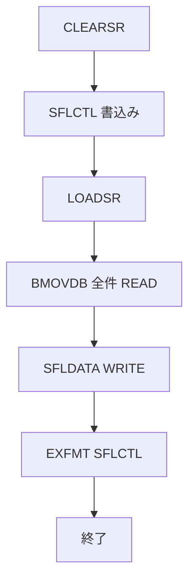

# BEEMOVIE

## 1.機能概要

`BMOVDB` の話者と台詞をサブファイルにロードして一覧表示する。

## 2.入出力

### *ENTRY PLIST の PARM

入口パラメータはない。

### 画面入力・出力

| 項目名 | 型 | 桁 | 画面フォーマット | 説明 |
|---|---|---:|---|---|
| `SPEAKER` | 文字 | 9A | `SFLDATA` 出力 | 話者 |
| `LINE` | 文字 | 50A | `SFLDATA` 出力 | Spoken Line |
| `RRN#` | 数値 | 4S0 | サブファイル制御 | 相対レコード番号 |

## 3.画面遷移

## 4.業務フロー

## 5.サブルーチン一覧

| BEGSR 名 | 役割 |
|---|---|
| `CLEARSR` | サブファイルをクリア |
| `LOADSR` | `BMOVDB` 全件をロード |

## 6.業務ルール・バリデーション

1. **BR-BEEMOVIE-01**: `BMOVDB` をキー順に全件読み、1行ずつ `SFLDATA` に書く。
2. **BR-BEEMOVIE-02**: 表示後、F3 で終了する。

RPG の挙動: DB が空でもエラー表示はない。Java での扱い（予定）: 空一覧を正常表示する。

## 7.DBアクセス

| ファイル | 操作 | キー |
|---|---|---|
| `BMOVDB` | `SETLL *LOVAL`/`READ` 全件 | `LINE` |

## 8.エラー処理・メッセージ一覧

CONST メッセージはない。固定文言 `SCREENPLAY DATABASE PROGRAM`、`Roll Up / Down = Scroll  F3 = Exit` を表示する。

## 9.前提(assumption)と RPG の既知の問題点

- 前提: サブファイルのページサイズは DDS の `SFLPAG(0010)` に従う。
- RPG の挙動: `RRN#` は実行時に加算される。Java での扱い（予定）: ページング API で同等表示にする。
