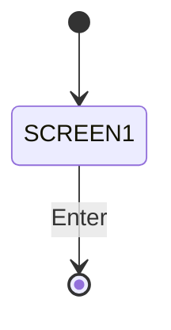
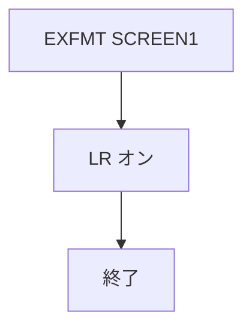

# CREDITS

## 1.機能概要

VCF/400 のクレジットと著作権を静的画面で表示する。

## 2.入出力

### *ENTRY PLIST の PARM

入口パラメータはない。

### 画面入力・出力

| 項目名 | 型 | 桁 | 画面フォーマット | 説明 |
|---|---|---:|---|---|
| — | 固定文字列 | — | `SCREEN1` | `VCF/400 - Credits and Copyright` 等 |

## 3.画面遷移

## 4.業務フロー

## 5.サブルーチン一覧

BEGSR はない。

## 6.業務ルール・バリデーション

1. **BR-CREDITS-01**: 起動時に `SCREEN1` を一度表示する。

RPG の挙動: 入力値検証はない。Java での扱い（予定）: 静的ページとして提供する。

## 7.DBアクセス

DB アクセスなし。

## 8.エラー処理・メッセージ一覧

CONST はない。DSPF 固定文言（`VCF/400 V1R0 - Copyright (c) 2023--2024 The Little Beige Box` 等）を表示する。

## 9.前提(assumption)と RPG の既知の問題点

- 前提: 静的画面の英語文言は原文のまま移行する。
