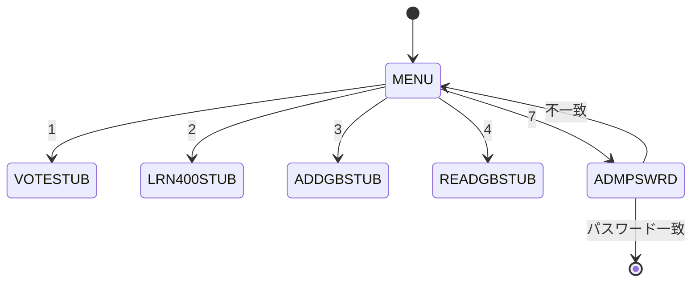
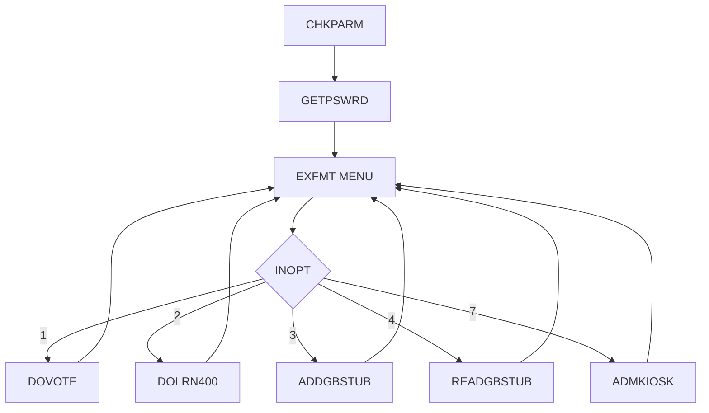

# EXHBMENU

## 1.機能概要

出展者情報と利用可能な機能を表示するメニュー。`ELIGIBLE` と `ENLRN400` により投票・LEARN/400 の選択肢を非表示にし、`MM2024` を含む入力パスワードでキオスクを終了する。

## 2.入出力

### *ENTRY PLIST の PARM

| 順序 | 名前 | 型/桁 | 説明 |
|---:|---|---|---|
| 1 | `LAUNCH` | 文字 9A | 出展者 ID |

### 画面入力・出力

| 項目名 | 型 | 桁 | 画面フォーマット | 説明 |
|---|---|---:|---|---|
| `OUTTITLE` | 文字 | 75A | `MENU` | 展示タイトル |
| `OUTNAME` | 文字 | 25A | `MENU` | 出展者名 |
| `OUTCITY` | 文字 | 15A | `MENU` | 市 |
| `OUTSTATE` | 文字 | 2A | `MENU` | 州 |
| `OUTDESC` | 文字 | 1000A | `MENU` | 説明 |
| `INOPT` | 数値 | 1Y0 | `MENU` | 1〜4、7 |
| `INPWD` | 文字 | 9A | `ADMPSWRD` | 終了パスワード |
| `DLTEXHNAM` | 文字 | 9A | `ADMDELETE`/`ADMDELETE2` | 削除確認表示 |

## 3.画面遷移

## 4.業務フロー

## 5.サブルーチン一覧

| BEGSR 名 | 役割 |
|---|---|
| `DOVOTE` | 投票可否を確認し `VOTESTUB` |
| `DOLRN400` | LEARN/400 可否を確認し `LRN400STUB` |
| `ADMKIOSK` | 終了パスワードを入力 |
| `GETPSWRD` | `SETTINGS` の先頭値を取得 |
| `CHKPARM` | 出展者情報と機能フラグを取得 |

## 6.業務ルール・バリデーション

1. **BR-EXHBMENU-01**: `LAUNCH` を `EXHBDB.EXHUSRPRF` で読み、展示情報を表示する。
2. **BR-EXHBMENU-02**: `ELIGIBLE≠1` の場合、`*IN41` で投票選択肢を非表示にする。
3. **BR-EXHBMENU-03**: `ENLRN400≠1` の場合、`*IN40` で LEARN/400 選択肢を非表示にする。
4. **BR-EXHBMENU-04**: `INOPT=1` は `CHKALWVOTE=1` の場合のみ `VOTESTUB`。
5. **BR-EXHBMENU-05**: `INOPT=2` は `CHKLRN400=1` の場合のみ `LRN400STUB`。
6. **BR-EXHBMENU-06**: `INOPT=3/4` は各ゲストブックスタブ、`7` は `ADMPSWRD`。
7. **BR-EXHBMENU-07**: 入力パスワードが終了値と一致したら LR をオンにする。

RPG の挙動: `GETPSWRD` は `*START` から先頭レコードを読むため、キー順では `ALWVOTE` の値が `EXITPSWRD` になる。Java での扱い（予定）: `SETTING='PASSWORD'` の値を使う。未定義の選択はメニューへ戻る前提である。

## 7.DBアクセス

| ファイル | 操作 | キー |
|---|---|---|
| `EXHBDB` | `SETLL`/`READ` | `EXHUSRPRF=LAUNCH` |
| `SETTINGS` | `SETLL *START`/`READ` | 先頭レコード（RPG） |

## 8.エラー処理・メッセージ一覧

画面に固有の CONST はない。`ADMPSWRD` の固定文言は `Are you sure you want to exit the kiosk?`、`Type the Administrator password, press ENTER to sign off`。

## 9.前提(assumption)と RPG の既知の問題点

- 前提: `ADMMAIN` からも必要な管理機能へ遷移できる。
- RPG の挙動: `GETPSWRD` が `ALWVOTE` をパスワードとして使い得る。Java での扱い（予定）: `PASSWORD` を正とする。
- RPG の挙動: `SECOFRS` 認可をこのプログラムでは実施しない。Java での扱い（予定）: 管理操作に認可を追加する。
