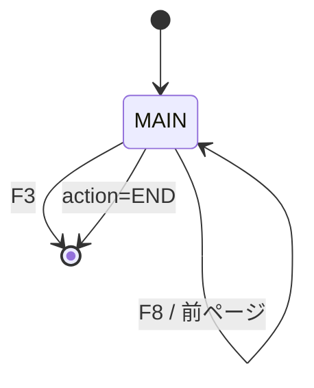
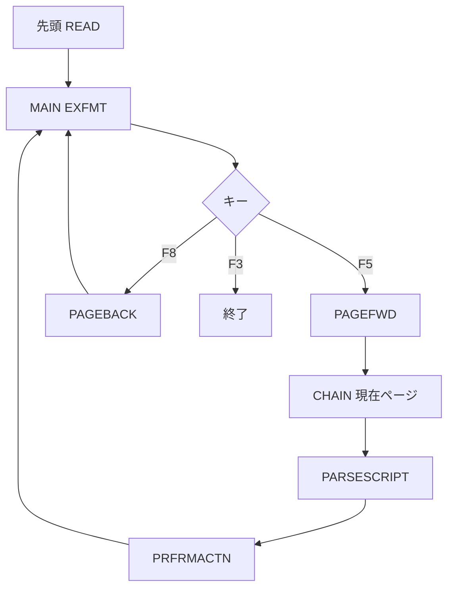

# LRN400

## 1.機能概要

`LRN400STR` のページを手動で前後移動し、`CONTENT` とページ制御命令を表示する LEARN/400 閲覧プログラムである。`EXTRA='END'`、`CONTENT='CALL'`、`CONTENT='JUMP'` を命令として解釈する。

## 2.入出力

### *ENTRY PLIST の PARM

RPG ソースでは `*ENTRY PLIST` と `LAUNCH` がコメントアウトされているため、実引数なしが現状である。

| 順序 | 名前 | 型/桁 | 説明 |
|---:|---|---|---|
| — | `LAUNCH` | 9A（コメントアウト） | `LRN400STUB` がプロファイル別 DB を切り替える |

### 画面入力・出力

| 項目名 | 型 | 桁 | 画面フォーマット | 説明 |
|---|---|---:|---|---|
| `OUTPAGENBR` | 文字 | 4A | `MAIN` | 現在ページ |
| `OUTCONTENT` | 文字 | 1500A | `MAIN` | ページ本文 |
| F3 | 指標 | — | `MAIN` | 終了 |
| F5/F8 | 指標 | — | `MAIN` | 前進/後退 |

## 3.画面遷移

## 4.業務フロー

## 5.サブルーチン一覧

| BEGSR 名 | 役割 |
|---|---|
| `PARSESCRIPT` | `EXTRA`/本文を命令として解析 |
| `PRFRMACTN` | END/CALL/JUMP の実行 |
| `JUMPTO` | CALL/JUMP 後のページ位置変更 |
| `PAGEFWD` | 次ページを読む。末尾で停止 |
| `PAGEBACK` | 前ページを読む。ジャンプ元を考慮 |
| `CHKPARM` | 現状空（入口引数コメントアウト） |

## 6.業務ルール・バリデーション

1. **BR-LRN400-01**: 初期表示は `LRN400STR` の先頭レコード。
2. **BR-LRN400-02**: `ALWFWD=1` のとき F5 で `CURPAGENBR+1`。
3. **BR-LRN400-03**: 次ページがない場合 `ALWFWD=0` とし、それ以降 F5 で進まない。
4. **BR-LRN400-04**: `EXTRA='END'` は終了、本文完全一致 `CALL` は `EXTRA` のプログラムを呼び、本文完全一致 `JUMP` は `EXTRA` ページへ移動する。
5. **BR-LRN400-05**: F8 は `CURPAGENBR` を減算し、`FRMPAGENBR` があればそのページを表示してリセットする。

RPG の挙動: `CHAIN` 不在時に前回表示内容が残り得る。ジャンプ直後の Back はジャンプ元の前ページを表示するが、`CURPAGENBR` は target-1 のままになる。Java での扱い（予定）: 状態機械として互換再現し、owner は CL の `OVRDBF` を列で表現する。

## 7.DBアクセス

| ファイル | 操作 | キー |
|---|---|---|
| `LRN400STR` | `READ` | 初期先頭 |
| `LRN400STR` | `CHAIN`/`READE` | `PAGENBR=CURPAGENBR` |

## 8.エラー処理・メッセージ一覧

RPG に表示用 CONST はなく、ページ本文と `EXTRA` が制御情報となる。使用する命令文言は `END`、`CALL`、`JUMP`（原文英語）である。

## 9.前提(assumption)と RPG の既知の問題点

- 前提: `LRN400STUB` の `OVRDBF` は Java の `owner` 列で再現する。
- 前提: `CALL` で指定される外部プログラム名は Java のサービス/ルートへ対応付ける。
- RPG の挙動: `LRN400` 自身の入口パラメータはコメントアウトされている。Java での扱い（予定）: HTTP セッションまたは owner パラメータで明示する。
