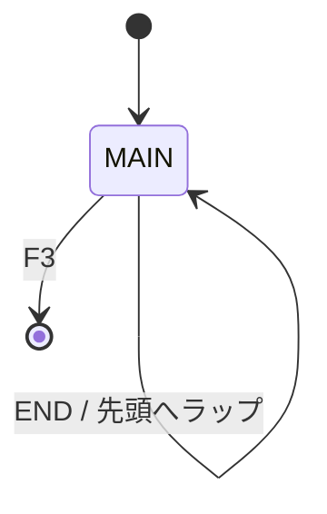
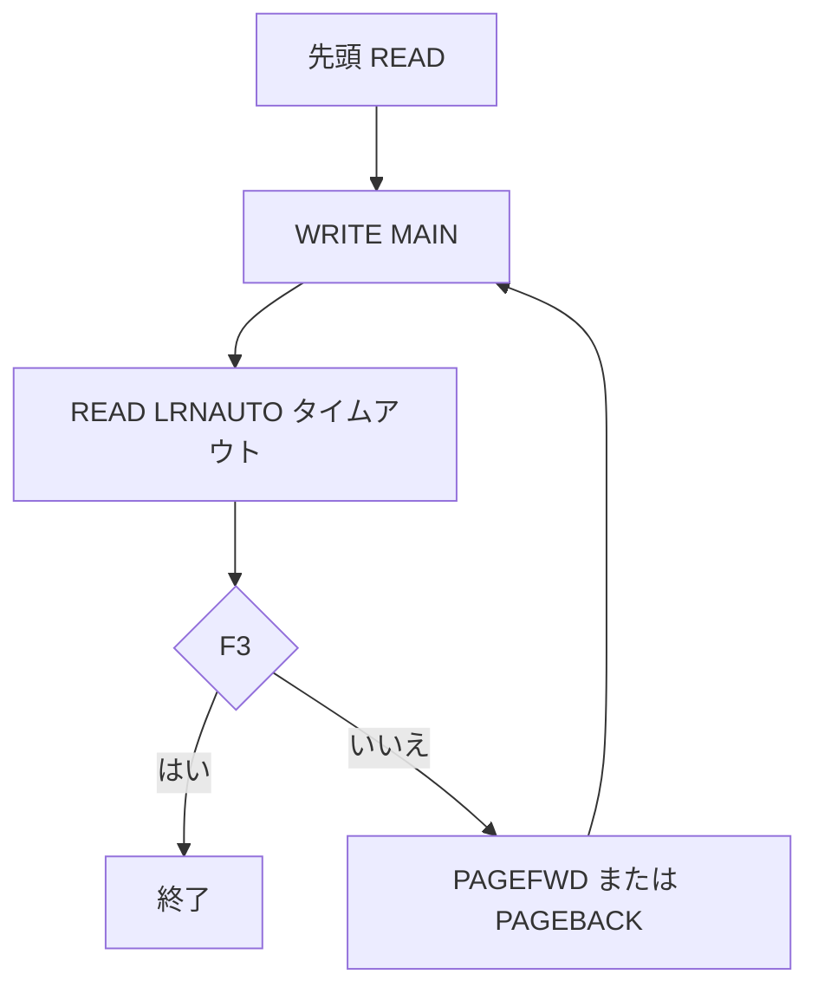

# LRN400AUT

## 1.機能概要

`LRN400` の自動スクロール版。`LRNAUTO` の `WAITRCD` 秒タイムアウトを使い、ページを書き出して自動的に前進する。`CALL` と `JUMP` は無効化され、`END` で先頭へラップする。

## 2.入出力

### *ENTRY PLIST の PARM

RPG ソースに入口パラメータ定義はない。`LRN400STUB` の DB オーバーライドを前提とする。

### 画面入力・出力

| 項目名 | 型 | 桁 | 画面フォーマット | 説明 |
|---|---|---:|---|---|
| `OUTPAGENBR` | 文字 | 4A | `MAIN` | 現在ページ |
| `OUTCONTENT` | 文字 | 1500A | `MAIN` | 本文 |
| F3/F5/F8 | 指標 | — | `MAIN` | 終了/前進/後退 |

## 3.画面遷移

## 4.業務フロー

## 5.サブルーチン一覧

| BEGSR 名 | 役割 |
|---|---|
| `PARSESCRIPT` | `EXTRA='END'` のみ解釈 |
| `PRFRMACTN` | END 時にページ位置を 0 に戻す |
| `PAGEFWD` | 自動次ページ。末尾を検知 |
| `PAGEBACK` | 前ページ表示 |

## 6.業務ルール・バリデーション

1. **BR-LRN400AUT-01**: `WAITRCD` 秒ごとに自動進行する。
2. **BR-LRN400AUT-02**: `EXTRA='END'` のみ認識し、`CALL`/`JUMP` は無効である。
3. **BR-LRN400AUT-03**: END で `CURPAGENBR=0` とし、次の前進で 1 ページ目に戻る。
4. **BR-LRN400AUT-04**: F3 で終了する。

RPG の挙動: `WRITE MAIN` と `READ LRNAUTO` のタイムアウトで進行し、通常の `EXFMT` はコメントアウトされている。`WAITRCD` は画面項目ではなく、RPG/DDS の待ち時間設定として扱う。Java での扱い（予定）: 自動進行 API または JavaScript タイマーで再現する。

## 7.DBアクセス

| ファイル | 操作 | キー |
|---|---|---|
| `LRN400STR` | `READ` | 初期先頭 |
| `LRN400STR` | `CHAIN`/`READE` | `PAGENBR` |

## 8.エラー処理・メッセージ一覧

表示用 CONST はない。制御文言 `END` は `EXTRA` の原文値である。

## 9.前提(assumption)と RPG の既知の問題点

- 前提: `WAITRCD` の単位は DSPF/RPG の IBM i 定義に従う。
- RPG の挙動: `CHAIN` 不在時に表示内容が残る可能性がある。Java での扱い（予定）: 表示状態を明示的に管理する。
