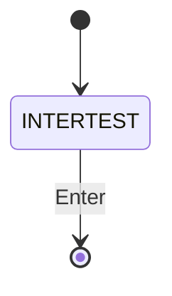
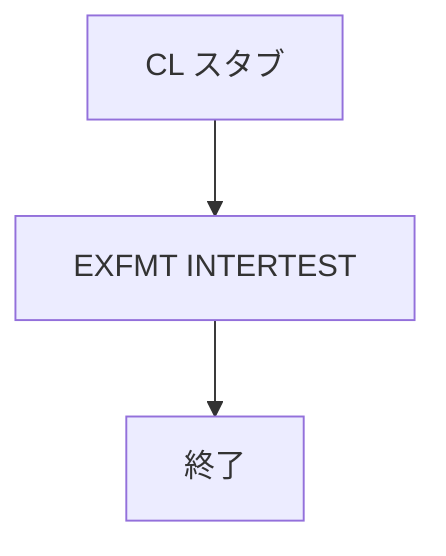

# NTRSTIT

## 1.機能概要

投票、コメントなどの操作前に表示する操作ヘルプ画面。CL スタブから呼び出される。

## 2.入出力

### *ENTRY PLIST の PARM

`*ENTRY PLIST` と `LAUNCH 20` はコメントアウトされている。

### 画面入力・出力

| 項目名 | 型 | 桁 | 画面フォーマット | 説明 |
|---|---|---:|---|---|
| — | 固定文字列 | — | `INTERTEST` | 操作説明 |

## 3.画面遷移

## 4.業務フロー

## 5.サブルーチン一覧

BEGSR はない。

## 6.業務ルール・バリデーション

1. **BR-NTRSTIT-01**: 呼出し時に `INTERTEST` を表示し、Enter 後に呼出し元へ戻る。

RPG の挙動: 入口パラメータは未実装。Java での扱い（予定）: 操作ヘルプを共通コンポーネントまたはページとして表示する。

## 7.DBアクセス

DB アクセスなし。

## 8.エラー処理・メッセージ一覧

CONST はない。画面固定の操作説明文言を使用する。

## 9.前提(assumption)と RPG の既知の問題点

- 前提: `ADDGBSTUB`、`READGBSTUB`、`VOTESTUB` は本体の前に必ず本画面を呼ぶ。
- RPG の挙動: `VCFSTUB` は `NTRSTIT` を呼ばない。Java での扱い（予定）: 呼出し元ごとの互換を維持する。
