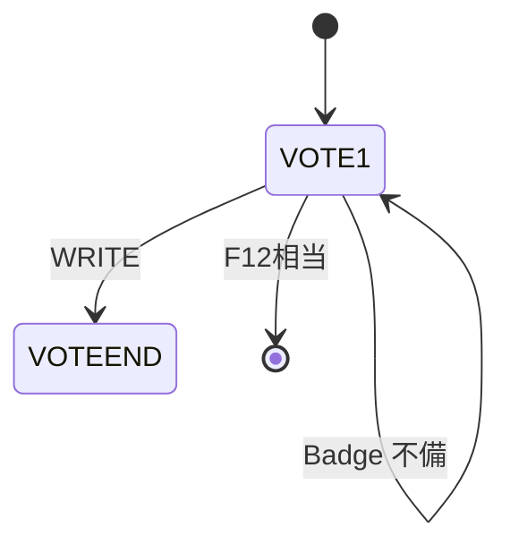
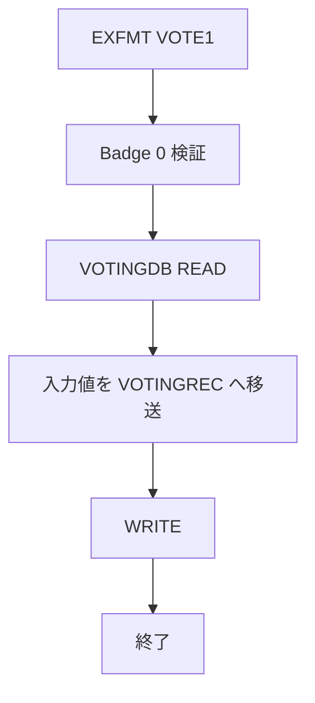

# OLDADDVOTE（旧版・非移行）

## 1.機能概要

`ADDVOTE` の旧版投票処理。`OLDVOTE` は本プログラムの呼出し/旧画面側実装として同じファイル内で扱う。フェーズ2以降の移行対象外である。

## 2.入出力

### *ENTRY PLIST の PARM

入口パラメータはない。

### 画面入力・出力

| 項目名 | 型 | 桁 | 画面フォーマット | 説明 |
|---|---|---:|---|---|
| `INPUTBADGE` | 10進数 | 4D0 | `VOTE1` | Badge Number |
| `INPUTEXHB` | 数値 | RPG 由来 | `VOTE1` | Exhibit ID（旧版） |
| `INPUTAWARD` | 10進数 | 3D0 | `VOTE1` | Award ID |
| `ERRLINE` | 文字 | 45A | `VOTE1` | エラー |

## 3.画面遷移

## 4.業務フロー

## 5.サブルーチン一覧

| BEGSR 名 | 役割 |
|---|---|
| `ADDTODB` | 重複・展示・賞を確認して登録 |
| `CHKPARM` | 空サブルーチン |
| `ENDVOTE` | `VOTEEND` 表示 |

`OLDVOTE` は BEGSR なしの旧直線処理である。

## 6.業務ルール・バリデーション

1. **BR-OLDADDVOTE-01**: `INPUTBADGE=0` の場合 `Must enter badge number`。
2. **BR-OLDADDVOTE-02**: 旧版の入力値を `VOTINGREC` に移送して WRITE する。
3. **BR-OLDADDVOTE-03**: `OLDVOTE` は `Must fill out all fields` を設定するが、処理を中断する RETURN はコメントアウトされている。

RPG の挙動: `ALWVOTE`、`DAVE`、プロファイル制御がなく、`OLDVOTE` の重複チェック定数も実際には使われない。Java での扱い（予定）: 移行しない。仕様は歴史的互換情報としてのみ保持する。

## 7.DBアクセス

| ファイル | 操作 | キー |
|---|---|---|
| `VOTINGDB` | `CHAIN`（旧 `ADDTODB`） | `INPUTBADGE` |
| `VOTINGDB` | `READ` | 全件/EOF |
| `VOTINGDB` | `WRITE` | `BADGENBR` |
| `EXHBDB` | `SETLL`/`READ`、`CHAIN` | `INPUTEXHB` |
| `AWARDDB` | `CHAIN` | `INPUTAWARD` |

## 8.エラー処理・メッセージ一覧

| CONST 名 | 文言 | 使用有無 |
|---|---|---|
| `SUCCESS` | `You have voted successfully` | 定義のみ |
| `ERRBLKBG` | `Must enter badge number` | `OLDADDVOTE` 使用 |
| `ERRBLKEX` | `Must enter Exhibit ID` | `OLDADDVOTE` 使用 |
| `ERRBLKAW` | `Must enter Award ID` | `OLDADDVOTE` 使用 |
| `ERREXIST` | `You have already voted.` | 定義のみ |
| `ERRENTER` | `Use F5 key to submit` | 定義のみ |
| `ERRPROHB` | `Exhibit ineligible for award` | `OLDADDVOTE` 使用 |
| `ERRNOEXB` | `Exhibit does not exist` | `OLDADDVOTE` 使用 |
| `ERRNOAWD` | `Award does not exist.` | `OLDADDVOTE` 使用 |
| `ERRBLANK` | `Must fill out all fields` | `OLDVOTE` 使用 |

## 9.前提(assumption)と RPG の既知の問題点

- 前提: 「旧版・非移行」であり、Java の業務ルール ID は追跡用に記録するだけで実装対象にしない。
- RPG の挙動: 旧版は `ADDVOTE` の現行ルール（投票期間、特権プロファイル、DAVE）を持たない。
- RPG の挙動: `OLDVOTE` は空入力時も終了せず WRITE へ進み得る。Java での扱い（予定）: 非移行。
