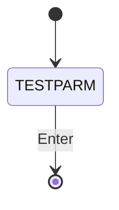
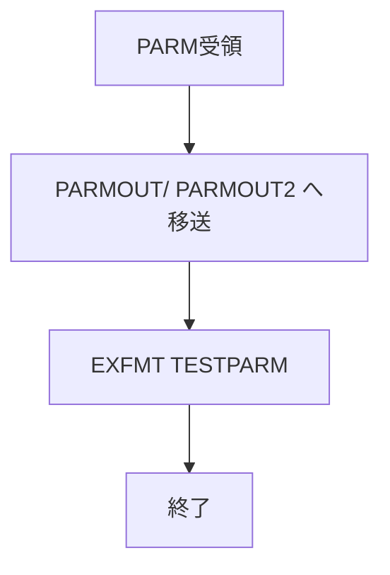

# PARAMETER

## 1.機能概要

受け取った2つの入口パラメータを画面に表示するテストプログラム。

## 2.入出力

### *ENTRY PLIST の PARM

| 順序 | 名前 | 型/桁 | 説明 |
|---:|---|---|---|
| 1 | `LAUNCH` | 文字 20A | 第1パラメータ |
| 2 | `LAUNCH2` | 文字 20A | 第2パラメータ |

### 画面入力・出力

| 項目名 | 型 | 桁 | 画面フォーマット | 説明 |
|---|---|---:|---|---|
| `PARMOUT` | 文字 | 20 | `TESTPARM` | `LAUNCH` の表示 |
| `PARMOUT2` | 文字 | 20 | `TESTPARM` | `LAUNCH2` の表示 |
| `SOMETHING` | 文字 | 5A | `TESTPARM` | テスト入力（RPG では未使用） |

## 3.画面遷移

## 4.業務フロー

## 5.サブルーチン一覧

BEGSR はない。

## 6.業務ルール・バリデーション

1. **BR-PARAMETER-01**: `LAUNCH` を `PARMOUT`、`LAUNCH2` を `PARMOUT2` に表示する。

RPG の挙動: `SOMETHING` は入力可能だが処理しない。Java での扱い（予定）: デバッグ用 API/ページとして限定提供する。

## 7.DBアクセス

DB アクセスなし。

## 8.エラー処理・メッセージ一覧

CONST はない。`Passed Parameter:`、`Press ENTER to quit` 等を表示する。

## 9.前提(assumption)と RPG の既知の問題点

- 前提: 本プログラムは業務機能ではなく移行検証用である。
