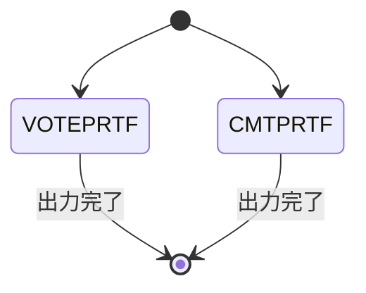
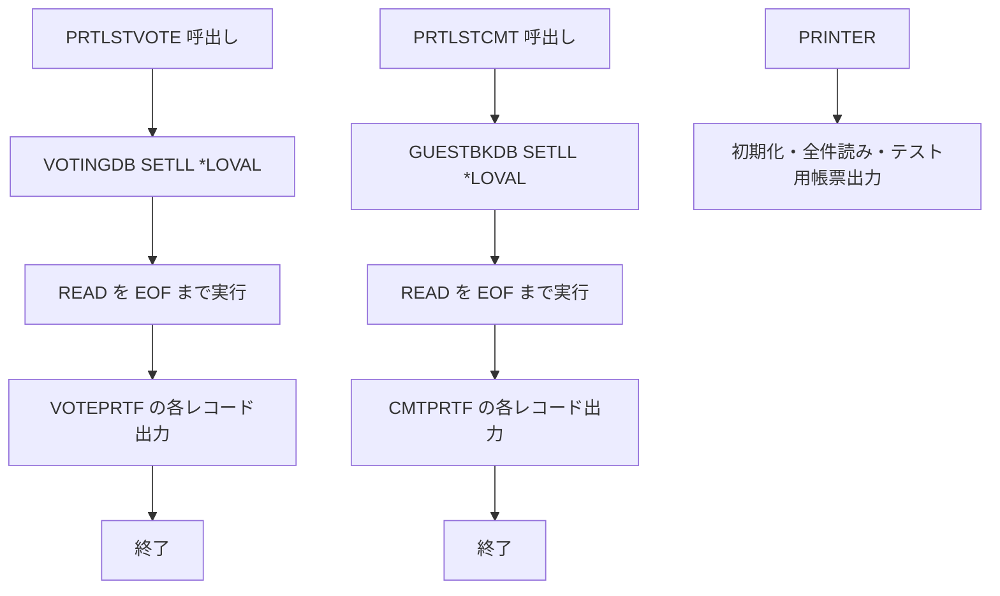

# PRTLSTVOTE

## 1.機能概要

投票登録後に `VOTINGDB` の最後のレコードを読み、`VOTEPRTF` のレシートへ出力する。関連する `PRTLSTCMT`、`PRINTER` も本書で扱う。

## 2.入出力

### *ENTRY PLIST の PARM

入口パラメータはない。`ADDVOTE` から CALL される。

### 画面入力・出力

| 項目名 | 型 | 桁 | 画面フォーマット | 説明 |
|---|---|---:|---|---|
| — | プリンタ出力 | — | `VOTEPRTF` | `RCD001`、`RCD002`、`RCD003`、`EXHBOUT` |
| — | プリンタ出力 | — | `CMTPRTF` | `RCD001`、`RCD002`、`RCD003`、`CMTNBR`、`CMTDETAIL` |

## 3.画面遷移

## 4.業務フロー

## 5.サブルーチン一覧

BEGSR はない。`PRTLSTCMT`、`PRINTER` も直線的な処理である。

## 6.業務ルール・バリデーション

1. **BR-PRTLSTVOTE-01**: `VOTINGDB` を EOF まで読み、最後に読んだ投票をレシートへ出力する。
2. **BR-PRTLSTVOTE-02**: コメント印刷では `GUESTBKDB` の最後のコメントを出力する。
3. **BR-PRTLSTVOTE-03**: `PRINTER` は `X'1B40'` 初期化、帳票出力後 `X'1D56'` を送る。

RPG の挙動: DB の最後のレコード（通常は直前に登録したレコード）だけを印刷する。Java での扱い（予定）: 物理印刷の代わりに `PrintSpoolService` のログとメモリ上のリストへ記録する。空 DB の場合の内容は前提として空印刷とする。

## 7.DBアクセス

| ファイル | 操作 | キー |
|---|---|---|
| `VOTINGDB` | `SETLL *LOVAL`/`READ` EOF | キー順 |
| `GUESTBKDB` | `SETLL *LOVAL`/`READ` EOF | キー順 |
| `VOTEPRTF` | `WRITE` | プリンタレコード |
| `CMTPRTF` | `WRITE` | プリンタレコード |
| `CMTTST` | `WRITE` | `PRINTER` のテスト帳票 |

## 8.エラー処理・メッセージ一覧

CONST メッセージはない。プリンタ制御値 `X'1B40'`、`X'1D56'` は原文の制御コードである。

## 9.前提(assumption)と RPG の既知の問題点

- 前提: `PRTLSTVOTE` は `ADDVOTE` 成功時に呼ぶ。`ENDVOTE` 内のコメントアウトされた CALL は別経路である。
- RPG の挙動: 出力対象をキーで特定せず最終 READ レコードに依存する。Java での扱い（予定）: 登録直後のエンティティを明示的にスプールする。
- 前提: `QRLUSRC` の `VOTEPRTF`/`CMTPRTF` を Java の印刷 DTO に対応させる。
