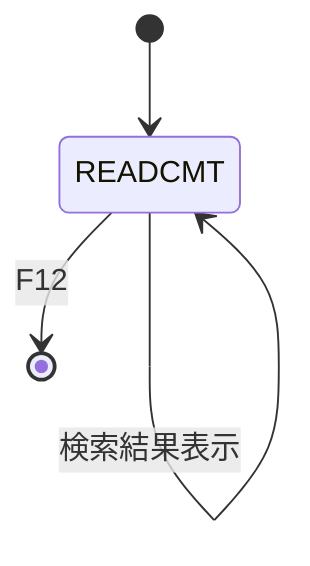
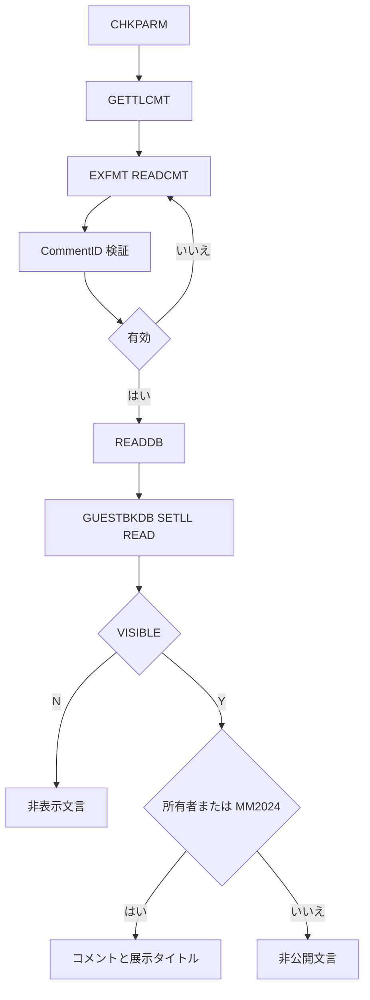

# READGBCMT

## 1.機能概要

ゲストブックのコメント ID を受け取り、公開状態と閲覧者の出展者 IDに応じてコメントを表示する。`MM2024` は全コメントを閲覧できる。

## 2.入出力

### *ENTRY PLIST の PARM

| 順序 | 名前 | 型/桁 | 説明 |
|---:|---|---|---|
| 1 | `LAUNCH` | 文字 20A | 現在ユーザプロファイル |

### 画面入力・出力

| 項目名 | 型 | 桁 | 画面フォーマット | 説明 |
|---|---|---:|---|---|
| `INCMTID` | 数値 | 4Y0 | `READCMT` | Comment ID |
| `WTFCMTNUM` | 数値 | 4 | `READCMT` | 現在の総コメント数 |
| `OUTNAME` | 文字 | 11A | `READCMT` | 投稿者名または `Name Hidden` |
| `OUTCMT` | 文字 | 200A | `READCMT` | コメントまたは状態文言 |
| `OUTTITLE` | 文字 | 50A | `READCMT` | 展示タイトル |
| `ERRLINE` | 文字 | 20A | `READCMT` | エラー/初期表示 |

## 3.画面遷移

## 4.業務フロー

## 5.サブルーチン一覧

| BEGSR 名 | 役割 |
|---|---|
| `READDB` | コメントを読み、公開・所有者権限で出力項目を設定 |
| `GETTLCMT` | 全コメントを読み `WTFCMTNUM` を設定 |
| `CHKPARM` | `USERPRF` と `ERRLINE` を初期化 |

## 6.業務ルール・バリデーション

1. **BR-READGBCMT-01**: `INCMTID=0` は `Must enter CommentID`、`*IN43`。
2. **BR-READGBCMT-02**: `VISIBLE='N'` は名前を `Name Hidden`、本文を `This comment hidden by an admin - offensive content.` とする。
3. **BR-READGBCMT-03**: 公開コメントは `EXHBID=USERPRF` または `USERPRF='MM2024'` の場合のみ表示する。
4. **BR-READGBCMT-04**: 権限のないコメントは `This comment is not part of this guestbook.` とし、名前とタイトルを空にする。
5. **BR-READGBCMT-05**: `WTFCMTNUM` は最終 `CMTID` を総コメント数として表示する。

RPG の挙動: `SETLL+READ` は不存在 ID で次のコメントを読み得る。さらに `READDB` 後に `EXFMT` がなく、結果は次回呼出し依存となる。Java での扱い（予定）: Comment ID 完全一致で検索し、見つからない場合を明示し、結果を即時返却する。

## 7.DBアクセス

| ファイル | 操作 | キー |
|---|---|---|
| `GUESTBKDB` | `READ` 全件 | `GETTLCMT` |
| `GUESTBKDB` | `SETLL`/`READ` | `CMTID=INCMTID` |
| `EXHBDB` | `SETLL`/`READ` | `EXHUSRPRF=EXHBID` |

## 8.エラー処理・メッセージ一覧

| CONST 名 | 文言 | 使用有無 |
|---|---|---|
| `ERRCMTID` | `Must enter CommentID` | 使用 |
| `ERRHNAME` | `Name Hidden` | 使用 |
| `ERRPNAME` | `Private Comment` | 未使用 |
| `ERREXIST` | `Exhibit not found` | 定義のみ |
| `ERRHCMT` | `This comment hidden by an admin - offensive content.` | 使用 |
| `ERRPRIV` | `This comment is not part of this guestbook.             ` | 使用 |
| `BLNK` | 空白 | 使用 |

## 9.前提(assumption)と RPG の既知の問題点

- 前提: `MM2024` は管理者として全コメントを閲覧できる。
- RPG の挙動: `CHKPARM` は `ERRLINE=USERPRF` とする癖がある。Java での扱い（予定）: 初期エラー欄へのユーザ ID 表示は互換要否を確認する。
- RPG の挙動: `EXHBDB` の展示が見つからない場合のタイトル扱いは明示されていない。Java での扱い（予定）: 見つからない結果をエラーとして返す。
